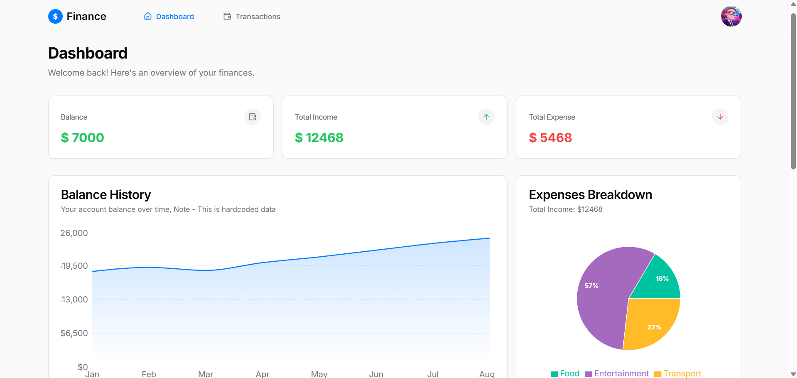

# Project Name



## Getting Started

To set up and run this project locally, follow these steps:

1. Install dependencies:
   ```sh
   npm install
   ```
2. Build the project:
   ```sh
   npm run build
   ```
3. Start the project:
   ```sh
   npm run preview
   ```

## Login Credentials (For Testing)

If you don't want to sign up, you can use the following credentials:

- **Email**: `vikaschouhan360@gmail.com`
- **Password**: `Vikas@123`

## Tech Stack

This project is built using:

- **Frontend**: React 18.3.0, TypeScript, Tailwind CSS, React Context API
- **Backend**: Supabase

## Hope You Like the Project! 🚀

